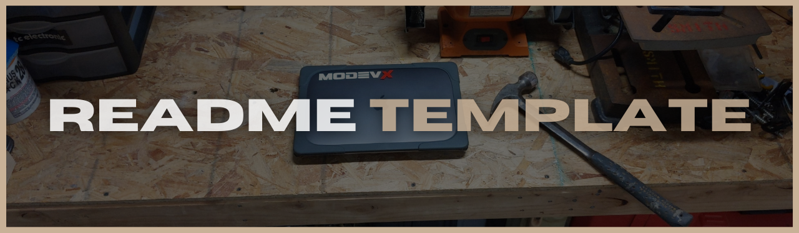
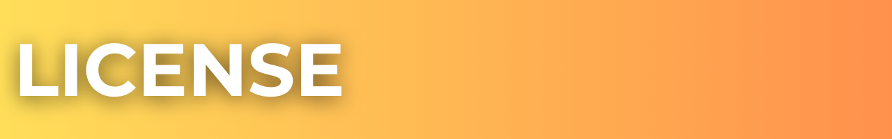
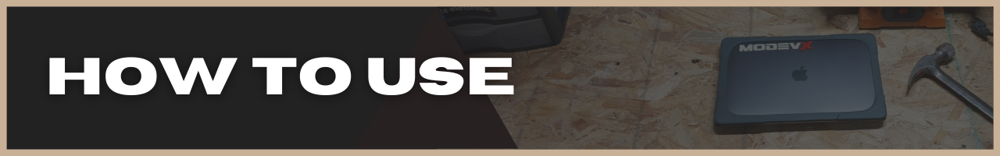
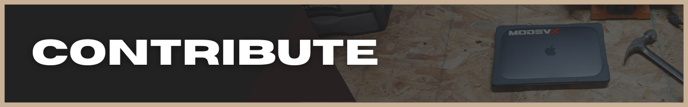

<div id='title' align='center'>
  
</div>

<div id='intro' align='right'>
  <div>
    <a href='#intro'>intro</a>&nbsp; |&nbsp;
    <a href='#license'>license</a>&nbsp; |&nbsp;
    <a href='#features'>features</a>&nbsp; |&nbsp;
    <a href='#use'>how to use</a>&nbsp; |&nbsp;
    <a href='#contribute'>contribute</a>&nbsp; |&nbsp;
    <a href='#connect'>connect</a>
  </div>
  <br/>
</div>

<div align='center'>
Write a description that gets people excited and curious about your project. This is a good spot to practice your "elevator pitch." You never know who you might run into;)
</div>

<br>

<div id='license' align='center'>
  
</div>

<div align='right'>
  <div>
    <a href='#intro'>intro</a>&nbsp; |&nbsp;
    <a href='#license'>license</a>&nbsp; |&nbsp;
    <a href='#features'>features</a>&nbsp; |&nbsp;
    <a href='#use'>how to use</a>&nbsp; |&nbsp;
    <a href='#contribute'>contribute</a>&nbsp; |&nbsp;
    <a href='#connect'>connect</a>
  </div>
  <br/>
</div>

_Let people know if it's ok to steal and go make millions with your code. Is your project 100% OpenSource? Explain the "allowable" ways people can use/not use your code._

### The MIT License (MIT)

Copyright © 2021 \<your company name\>

Permission is hereby granted, free of charge, to any person obtaining a copy of this software and associated documentation files (the “Software”), to deal in the Software without restriction, including without limitation the rights to use, copy, modify, merge, publish, distribute, sublicense, and/or sell copies of the Software, and to permit persons to whom the Software is furnished to do so, subject to the following conditions:

The above copyright notice and this permission notice shall be included in all copies or substantial portions of the Software.

THE SOFTWARE IS PROVIDED “AS IS”, WITHOUT WARRANTY OF ANY KIND, EXPRESS OR IMPLIED, INCLUDING BUT NOT LIMITED TO THE WARRANTIES OF MERCHANTABILITY, FITNESS FOR A PARTICULAR PURPOSE AND NONINFRINGEMENT. IN NO EVENT SHALL THE AUTHORS OR COPYRIGHT HOLDERS BE LIABLE FOR ANY CLAIM, DAMAGES OR OTHER LIABILITY, WHETHER IN AN ACTION OF CONTRACT, TORT OR OTHERWISE, ARISING FROM, OUT OF OR IN CONNECTION WITH THE SOFTWARE OR THE USE OR OTHER DEALINGS IN THE SOFTWARE.

<div id='features' align='center'>
  
</div>

<div align='right'>
  <div>
    <a href='#intro'>intro</a>&nbsp; |&nbsp;
    <a href='#license'>license</a>&nbsp; |&nbsp;
    <a href='#features'>features</a>&nbsp; |&nbsp;
    <a href='#use'>how to use</a>&nbsp; |&nbsp;
    <a href='#contribute'>contribute</a>&nbsp; |&nbsp;
    <a href='#connect'>connect</a>
  </div>
  <br/>
</div>

## **Feature 1**

## **Feature 2**

<div id='how-to-use' align='center'>
  
</div>

<div align='right'>
  <div>
    <a href='#intro'>intro</a>&nbsp; |&nbsp;
    <a href='#license'>license</a>&nbsp; |&nbsp;
    <a href='#features'>features</a>&nbsp; |&nbsp;
    <a href='#use'>how to use</a>&nbsp; |&nbsp;
    <a href='#contribute'>contribute</a>&nbsp; |&nbsp;
    <a href='#connect'>connect</a>
  </div>
  <br/>
</div>

_Instruct users on how they can get up and running once they have your brain baby on their computer._

### **_Run Your New Project_**

```shellscript
// make sure you installed the dependencies first

npm run dev

OR

yarn run dev
```

_Download? Clone from GitHub? Let people know how they can get their hands on your project._

### **_Clone The Repo_**

```shellscript
cd <parent-folder-path/>
```

```shellscript
git clone https://github.com/ephbuilding/a-readme-template.git
```

### **_Install Project Dependencies_**

```shellscript
cd <new-project-path/>
```

```shellscript
npm install

OR

yarn
```

_Every project is set up different. Give users the rundown on the various working parts of your project._

<details>
<summary><strong>Folder Structure:</strong></summary>

```shellscript
// example folder structure

your-app-name/...................root directory
  __tests__/.....................tests
  dist/..........................deployment folder
  node_modules/..................project dependencies
  public/........................copied to dist/
  src/...........................MAIN PROJECT FOLDER
    assets/......................images, fonts
    components/..................React components
    hooks/.......................custom React hooks
    pages/.......................pages view components
    services/....................3rd-party data resources
    styles/......................CSS stylesheets
    App.jsx......................project root component
    index.js.....................PROJECT ENTRY POINT
  .env...........................environment variables
  .gitignore.....................don't expose those .env keys!
  package.json...................project dependency config
  README.md......................you are here [X]
  yarn.lock......................dependency lock file
```

</details>

<details>
<summary><strong>Dependencies:</strong></summary>

### **_Production_**

`react` | JavaScript library for creating user interfaces

`react-dom` | React package for working with the DOM

`react-query` | Hooks for managing, caching and syncing asynchronous and remote data in React

### **_Development_**

`jest` | JavaScript test runner

`tailwindcss` | utility-first CSS framework

`postcss` | JavaScript plugins that analyze and transform CSS

</details>

<details>
<summary><strong>Scripts:</strong></summary>

`"dev"` runs the app in `development` mode

`"test"` runs `"jest"` in interactice watch mode

`"build"` prepares your app's code for production to the `dist/` folder

</details>

<br>

<div id='contribute' align='center'>
  
</div>

<div align='right'>
  <div>
    <a href='#intro'>intro</a>&nbsp; |&nbsp;
    <a href='#license'>license</a>&nbsp; |&nbsp;
    <a href='#features'>features</a>&nbsp; |&nbsp;
    <a href='#use'>how to use</a>&nbsp; |&nbsp;
    <a href='#contribute'>contribute</a>&nbsp; |&nbsp;
    <a href='#connect'>connect</a>
  </div>
  <br/>
</div>

### **_Issues:_**

_Provide the steps you want people to take when complaining about your project;)_

### **_Pull Requests:_**

_Provide the steps you want users to take when submitting code changes to your project._

<div id='connect' align='center'>
  
</div>

<div align='right'>
  <div>
    <a href='#intro'>intro</a>&nbsp; |&nbsp;
    <a href='#license'>license</a>&nbsp; |&nbsp;
    <a href='#features'>features</a>&nbsp; |&nbsp;
    <a href='#use'>how to use</a>&nbsp; |&nbsp;
    <a href='#contribute'>contribute</a>&nbsp; |&nbsp;
    <a href='#connect'>connect</a>
  </div>
  <br/>
</div>

 <div align='center'>
    <a href='https://github.com/ephcoding' alt='github icon'>
      
    </a>
    &nbsp;
    &nbsp;
    <a href='https://twitter.com/_ephraimsmith_' alt='twitter icon'>
      
    </a>
    &nbsp;
    &nbsp;
    <a href='https://linkedin.com/in/ephraimjsmith' alt='linkedin icon'>
      
    </a>
    &nbsp;
    &nbsp;
    <a href='mailto:ephraimjsmith@gmail.com' alt='email icon'>
      
    </a>
  </div>
