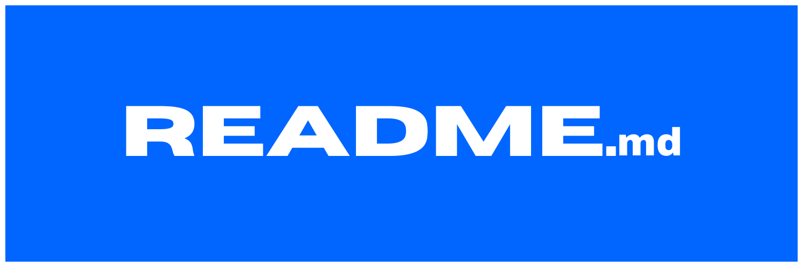
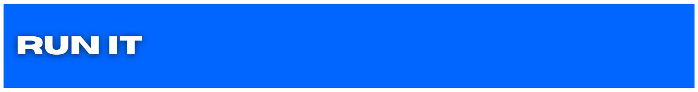
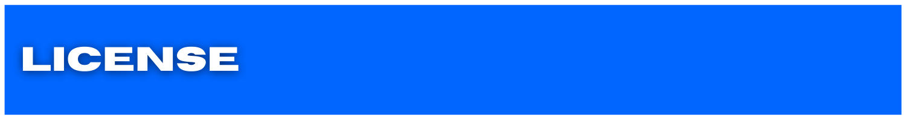

Lorem ipsum dolor sit amet, consectetur adipiscing elit. Sed lacus nulla, vehicula condimentum molestie at, bibendum vitae ante. Curabitur risus arcu, finibus a vulputate quis, convallis eu lectus. Vestibulum rhoncus euismod mauris vitae accumsan. Etiam sit amet facilisis tortor, ut malesuada est. Quisque pellentesque tempor quam, id suscipit odio auctor eget.


1. [Run It](#run-it)
1. [How To Use](#how-to-use)
1. [Shout-Outs](#shout-outs)
1. [License](#license)
1. [Stats](#stats)
1. [Contribute](#contribute)
1. [Resources](#resources)
1. [Connect](#connect)

<h2 id='run-it' align='center'>

</h2>

### **CLONE IT**

```zsh
git clone https://github.com/ephcoding/readme.git
```

### **INSTALL DEPENDENCIES**

```zsh
npm i
```

<h2 id='how-to-use' align='center'>

</h2>

<!-- #region -->

<details>
<summary><strong>DropDown:</strong></summary>

- notes for days...

</details>

<br>

<h2 id='shout-outs' align='center'>

</h2>

### **FirstName LastName**

\< social \> | [@username](https://some.address)

\< site \> | [link](https://some.address)

<h2 id='license' align='center'>

</h2>

The MIT License (MIT)

Copyright © 2021 <copyright holders>

Permission is hereby granted, free of charge, to any person obtaining a copy of this software and associated documentation files (the “Software”), to deal in the Software without restriction, including without limitation the rights to use, copy, modify, merge, publish, distribute, sublicense, and/or sell copies of the Software, and to permit persons to whom the Software is furnished to do so, subject to the following conditions:

The above copyright notice and this permission notice shall be included in all copies or substantial portions of the Software.

THE SOFTWARE IS PROVIDED “AS IS”, WITHOUT WARRANTY OF ANY KIND, EXPRESS OR IMPLIED, INCLUDING BUT NOT LIMITED TO THE WARRANTIES OF MERCHANTABILITY, FITNESS FOR A PARTICULAR PURPOSE AND NONINFRINGEMENT. IN NO EVENT SHALL THE AUTHORS OR COPYRIGHT HOLDERS BE LIABLE FOR ANY CLAIM, DAMAGES OR OTHER LIABILITY, WHETHER IN AN ACTION OF CONTRACT, TORT OR OTHERWISE, ARISING FROM, OUT OF OR IN CONNECTION WITH THE SOFTWARE OR THE USE OR OTHER DEALINGS IN THE SOFTWARE.

<h2 id='stats' align='center'>

</h2>


<h2 id='contribute' align='center'>

</h2>

### **ISSUES:**

Lorem ipsum dolor sit amet, consectetur adipiscing elit. Sed lacus nulla, vehicula condimentum molestie at, bibendum vitae ante.

### **PULL REQUESTS:**

Lorem ipsum dolor sit amet, consectetur adipiscing elit. Sed lacus nulla, vehicula condimentum molestie at, bibendum vitae ante.

<h2 id='resources' align='center'>

</h2>

- resource | [link](https://someline.internetland)

<h2 id='connect' align='center'>

</h2>

[]()


Email: ephraim@modevx.com
